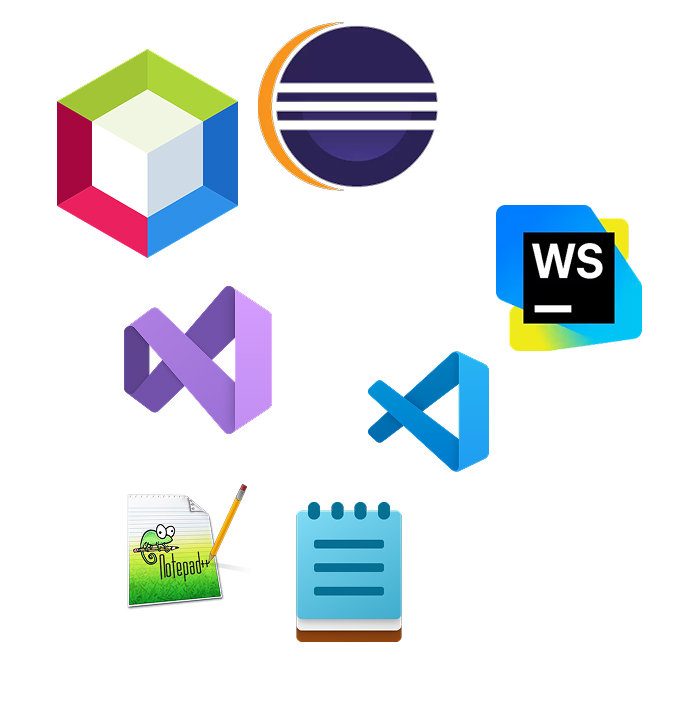

# IDEs

## Fundamentos
### ¿Qué es un IDE?

Un entorno de desarrollo integrado (*integrated development environment*) es un tipo de software que facilita el desarrollo a un programador para el desarrollo de otro software.

Habitualmente, los IDEs contienen un editor de texto para el código fuente, un depurador (*debugger*) y alguna herramienta para ver el resultado (compilador, previsualizador, …)

Actualmente este tipo de software permite el uso de herramientas avanzadas cómo el uso de terminal, control de versiones, programación visual, etc...

**IDEs vs Editores Básicos**

| **IDEs**                              | **Editores Básicos**                      |
| ------------------------------------- | ----------------------------------------- |
| **Ventajas**                          | **Ventajas**                              |
| ✅ Autocompletado inteligente          | ✅ Arranque instantáneo                    |
| ✅ Depurador integrado                 | ✅ Consumo mínimo de recursos              |
| ✅ Gestión de proyectos                | ✅ Simplicidad de uso                      |
| ✅ Control de versiones integrado      | ✅ Personalización total                   |
| ✅ Detección de errores en tiempo real | ✅ Funciona en hardware limitado           |
| **Desventajas**                       | **Desventajas**                           |
| ❌ Consumo alto de memoria             | ❌ Sin autocompletado avanzado             |
| ❌ Arranque lento                      | ❌ Depuración manual                       |
| ❌ Curva de aprendizaje pronunciada    | ❌ Sin gestión de proyectos                |
| ❌ Interfaz compleja                   | ❌ Configuración manual extensa            |
| ❌ Algunos son de pago                 | ❌ Menos productivo para proyectos grandes |

### Panorama de IDEs

IDEs hay muchos. Unos más famosos y otros menos. Al final un IDE es bueno si te sirve a ti como ingeniero/a para realizar el desarrollo del proyecto de la manera más eficiente para ti y el proyecto concreto en el que estás trabajando.

Se pueden separar en tres categorías no oficiales pero que nos ayudan a elegir:

#### IDEs por lenguaje
Los IDEs por lenguaje se caracterizan por estar diseñados alrededor de un lenguaje o ecosistema en concreto. Para Java existen programas como IntelliJ idea, Netbeans o Eclipse. Para C# y .NET tenemos Visual Studio. Para Android, existe Android Studio.
Estos IDEs proporcionan una experiencia más completa y profunda, con herramientas enfocadas a el lenguaje objetivo.

#### IDEs multiplataforma/multilenguaje
Cuando queremos algo entre un editor de texto básico y un IDE pudiendo llegar a establecer un entorno de desarrollo completo a través de la instalación de extensiones, entonces necesitaremos un IDE multiplataforma/multilenguaje.

Este tipo de IDEs no sólo están pensados para poder trabajar con distintos lenguajes, sino que también en distintos sistemas operativos. Ejemplos, Visual Studio Code o Sublime Text.

En este curso nos centraremos en Visual Studio Code.
#### IDEs web/online
Los IDEs web/online es software cuya principal ventaja es la de tener un entorno completo accesible desde un navegador, sin la necesidad de instalar nada. Ejemplos son CodePen o GitHub Codespaces.

### Visual Studio Code

Podéis descargar Visual Studio Code [aquí](https://code.visualstudio.com)

#### Extensiones que esenciales
- Toda aquella instalación oficial del lenguaje objetivo. Aquí tenéis algunos ejemplos:
	- [C/C++](https://marketplace.visualstudio.com/items?itemName=ms-vscode.cpptools)
	- [C#](https://marketplace.visualstudio.com/items?itemName=ms-dotnettools.csharp)
	- [Lua](https://marketplace.visualstudio.com/items?itemName=sumneko.lua)
	- [Python](https://marketplace.visualstudio.com/items?itemName=ms-python.python)
- Extensiones de autocompletado
- Extensiones de formateo:
	- [Prettier](https://marketplace.visualstudio.com/items?itemName=esbenp.prettier-vscode)
- [Live Server](https://marketplace.visualstudio.com/items?itemName=ritwickdey.LiveServer): Despliegue local rápido para visualizar páginas web.
- [indent-rainbow](https://marketplace.visualstudio.com/items?itemName=oderwat.indent-rainbow): Ayuda para la visaulización de indentación
- [CodeSnap](https://marketplace.visualstudio.com/items?itemName=adpyke.codesnap): Saca capturas bonitas del código (útil para trabajos).
- Temas para tener colores bonitos:
	- [eppz!](https://marketplace.visualstudio.com/items?itemName=eppz.eppz-code)
	- [Tokyo Night](https://marketplace.visualstudio.com/items?itemName=enkia.tokyo-night)

#### Funcionalidades clave de Visual Studio Code
- Autocompletado y sugerencias `Ctrl + Space`
- Depuración paso a paso `F5`
- Control de versiones integrado (a través de extensiones)
- Terminal integrada (con opción de tener varías) `Ctrl + Ñ`
- Búsqueda y remplazo avanzado `Ctrl + H`
- Búsqueda de archivos e inicio de procesos rápida `Ctrl + P para buscar, > para buscar procesos`

#### Consejos
- Instalar solo las extensiones necesarias para tus necesidades.
- Intentar buscar las oficiales y, sino hay disponibles, basarse en el número de descargas.
- Las extensiones de mascotas gastan muchos recursos y distraen más de lo que divierten.
