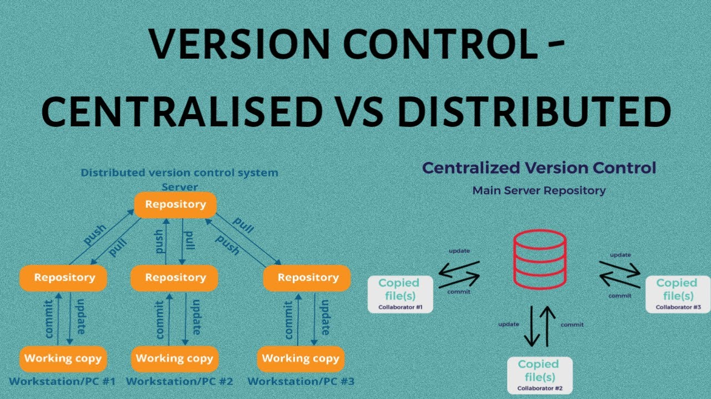

# GIT

## Control de Versiones
Un **sistema de control de versiones** es una herramienta que registra los cambios realizados en archivos a lo largo del tiempo, permitiendo recuperar versiones específicas cuando sea necesario. Es como tener un "historial de cambios" detallado de tu proyecto.

## Tipos de Sistemas de Control de Versiones

### **1. Sistemas Locales**
- Guardan versiones en tu computadora.
- **Problema**: No hay colaboración, riesgo de pérdida de datos.
- **Ejemplo**: RCS (Revision Control System)

### **2. Sistemas Centralizados**
- Un servidor central almacena todas las versiones.
- Los desarrolladores descargan archivos del servidor.
- **Ejemplos**: SVN (Subversion), Perforce, CVS.
- **Problemas**:
    - Si el servidor falla, nadie puede trabajar.
    - Punto único de falla.
    - Dependencia de conexión a internet.

### **3. Sistemas Distribuidos (Como Git)**
- Cada desarrollador tiene una **copia completa** del historial.
- No hay un punto central único.

## Representación Visual



## GIT - Fundamentos

### ¿Qué es Git?
Git es un software de control de versiones diseñado por Linus Torvalds. Enfocado a la eficiencia y la compatibilidad de versiones en archivos de código, su propósito es llevar registro de los cambios incluyendo coordinar el trabajo que varias personas realizan sobre archivos compartidos en un repositorio de código.

Gratis, de código abierto y compatible para proyectos tanto grandes cómo pequeños.


### Git y GitHub
**GitHub** es una forja (plataforma de desarrollo colaborativo) para alojar proyectos utilizando el sistema de control de versiones Git. Se utiliza principalmente para la creación de código fuente de programas de ordenador.

Podéis acceder a GitHub a través de este [enlace](https://github.com).

### Instalación

Para instalar GIT en Windows, se puede descargar la última versión [aquí](https://git-scm.com). Si usáis algún sistema operativo Linux, podéis usar el siguiente comando:

```
sudo apt install git-all
```

Para ver si está instalado correctamente, sólo hay que acceder al terminal e introducir el siguiente comando:

```
git --version
```


### Configuración inicial
Por su naturaleza colaborativa, Git utiliza un sistema de cuentas para poder conocer quién ha realizado los cambios en los archivos.
Para poder usar Git sin que te pida la contraseña en cada acción debemos configurarlo en un inicio con nuestras credenciales:

```
git config --global user.name "Tu Nombre" # Usuario de Git
git config --global user.email "tu@email.com" # Email de Git
git config --list # Lista los usuarios (opcional)
```


### Conceptos básicos

#### Los tres entornos de Git

**Working directory (Directorio de trabajo)**

Este es el directorio/carpeta en el que el ingeniero trabaja, ya sea para cambiar líneas de código, añadir o eliminar archivos, ...

Dentro de esta carpeta, aparte del proyecto a trabajar, tendremos la carpeta oculta *.git* que tiene toda la información sobre el repositorio local y remoto y sus ramas.

Un ejemplo de proyecto con Git sería:
```
mi-proyecto/ 
├── .git
├── index.html
├── style.css
└── script.js
```

Dato: El nombre de la carpeta "mi-proyecto" es el nombre del repositorio de Git.

**Staging Area (Área de "Preparación")** 

El *Staging Area* es un área intermedia al que iremos añadiendo los archivos que has modificado con el objetivo de preparar tu próximo *commit*.

Para añadir archivos al staging area sólo necesitaréis el siguiente comando:

```
git add index.html # Para un solo archivo
git add * # Para incluir al commit todo lo modificado
```


**Repositorio (carpeta .git)**

El repositorio guarda todas las modificaciones y versiones de forma permanente en el historial de git. Esta carpeta es la que va a coordinar con el repositorio remoto (GitHub, por ejemplo) para que se pueda acceder de manera remota.

Para añadir los cambios preparados en la staging area, debemos hacer un commit con el siguiente comando:

```
git commit -m "Add homepage design" # -m Indica el mensaje que vas a escribir entre comillas
```


#### Estados
Cuando ejecutamos el comando `git status` nos va a devolver una serie de estados por archivo. Cada uno tiene su significado:

- **Untracked**: El archivo con este estado es nuevo y no está añadido a git.
- **Modified**: Está en git y detecta cambios en el archivo.
- **Staged**: El archivo está en el *staging area*.
- **Commited**: El archivo está en el repositorio, registrado en el historial de git.

#### Diagrama de flujo
Git basa su organización en función a las ramas. ¿Pero qué son las ramas?
Las **ramas (branches)** son líneas independientes de desarrollo que te permiten trabajar en diferentes características o experimentos sin afectar el código principal.

Poniendo como analogía a un árbol, podemos decir que:

- **Tronco principal**: La rama `main` es código estable. A veces llamado `prod` o  `master`.
- **Ramas**: Diferentes direcciones de crecimiento. Ejemplos de ramas pueden ser `fix`, `beta`, `int` (integración)
- **Hojas**: Serían los commits individuales.
- **Merge**: Cuando una rama se une de vuelta al tronco.


#### El Formato
Como cuando cada lenguaje, patrón de diseño o tipo de proyecto tiene su formato de carpetas y archivos, Git también tiene el suyo. Puede variar de proyecto en proyecto pero aquí tenéis algunas convenciones:

**CONVENCIONES GENERALES**

Sea como sea tu proyecto asegúrate de cumplir las siguientes normas:

- **Minúsculas y separación por guiones:** Siempre escribe todo en minúsculas y separado por un guión (-).
- **Sólo caracteres alfanuméricos y guión:** Ni espacios, ni barras bajas, etc, etc...
- **Sólo un único guión**: Usar más de un guión puede ser confuso.
- **No terminar con un guión**
- **Descriptivos:** Con un vistazo deberíamos saber sobre qué trata la rama/commit.

**RAMAS**

**Feature Branches (Ramas de Funcionalidad):** Estas ramas se utilizan para desarrollar nuevas características o funcionalidades. 

Prefijo: `feature` o `feat` 

Ejemplos: 
```
feature/login-system # Sistema de login 
feature/shopping-cart # Carrito de compras
```

**Bugfix Branches (Ramas de Corrección de Errores):** Estas ramas se utilizan para corregir errores en el código existente. 

Prefijo: `bugfix` o `fix` 

Ejemplos:
```
bugfix/mobile-responsive # Problemas de responsive 
bugfix/database-connection # Error de conexión a BD
```

**Hotfix Branches (Ramas de Corrección Urgente):** Estas ramas se crean directamente desde la rama de producción para corregir errores críticos en el entorno de producción.

Prefijo: `hotfix/`

Ejemplos:
```
hotfix/data-corruption # Corrupción de datos 
hotfix/server-crash # Caída del servidor 
hotfix/memory-leak # Fuga de memoria
```

**Release Branches (Ramas de Lanzamiento):** Estas ramas se utilizan para preparar un nuevo lanzamiento a producción. Permiten hacer los ajustes finales y pulir detalles.

Prefijo: `release/`

Ejemplos:
```
release/v2.1.0 # Versión 2.1.0 
release/2024-march # Release de marzo 2024 
release/sprint-15 # Release del sprint 15
```


**Documentation Branches (Ramas de Documentación):** Estas ramas se utilizan para escribir, actualizar o corregir documentación, como archivos README.md, wikis, o documentación de API.

Prefijo: `docs/`

Ejemplos:
```
docs/api-endpoints # Documentar endpoints de API 
docs/installation-guide # Guía de instalación
```

**MENSAJE DE COMMITS**


Más información sobre el formato de los commits [aquí](https://gist.github.com/qoomon/5dfcdf8eec66a051ecd85625518cfd13).


### Más información
#### Comandos útiles

- `git log` Muestra el historial 
- `git diff` Muestra los cambios


Si queréis saber más sobre Git y sus posibilidades, [aquí tenéis la documentación](https://git-scm.com/doc).

